# Academia 🎓
### A Course Registration Portal

<br>

⚫ <b><i>Project Goal:</i></b>
<br><br>To develop a course registration system which is user-friendly and multi-functional. <p>

This project mainly deals with the concurrent operations in a safe and secure environment.
- Safe: Concurrency handling.
- Secure: Only authorized faculty and students can access and modify the data.

<br>

⚫ <b><i>Features of Academia:</i></b>
- The application can handle concurrent access and operations.
- Socket programming is used to implement client-server model.
- Storage/ Database: Unix File System. i.e., data is stored typically in files only.
- Password protected login system for both admins and customers.

<br>

⚫ <b><i>How to execute?:</i></b>
- Firstly add a new Admin using a file called "create_admin.c"
- Change the absolute path mentioned in the code.
- Now compile and run the Server:
```
cc server.c -o server.out
./server.out
```
- Compile and run the Client:
```
cc client.c -o client.out
./client.out
```
- Done!

<br>

⚫ <b><i>Output:</i></b>

<br>

<b>Starting Application -</b>
- Create an Admin account
# 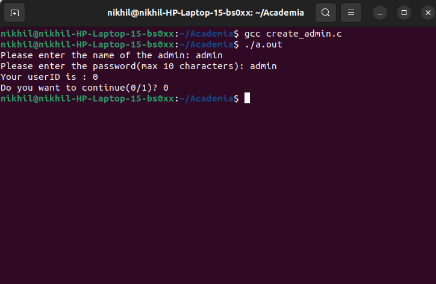
- Start Server
# 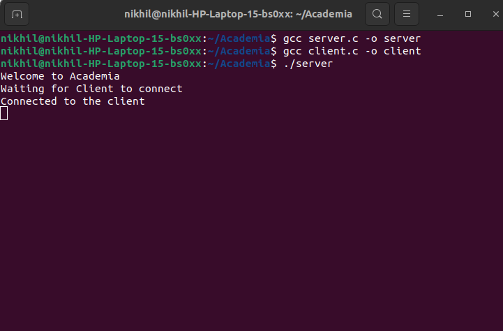
- Start Client
# 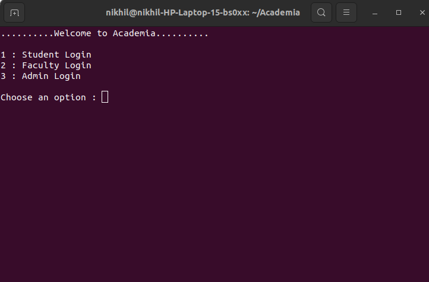

<br>

<b>Admin Functions -</b>
- Add student:
# 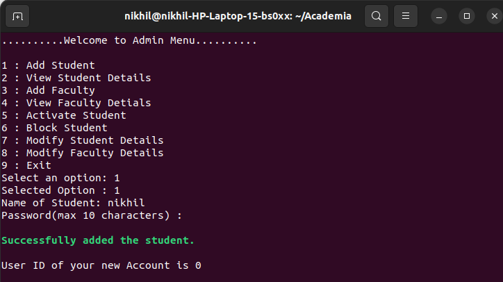
- View student details:
# 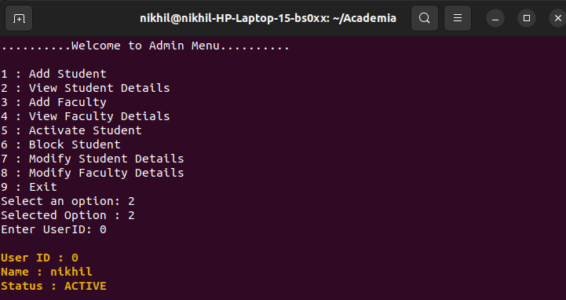
- Block student:
# 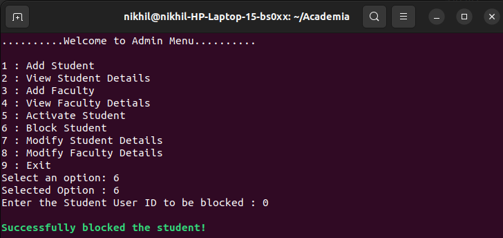
- After blocking:
# 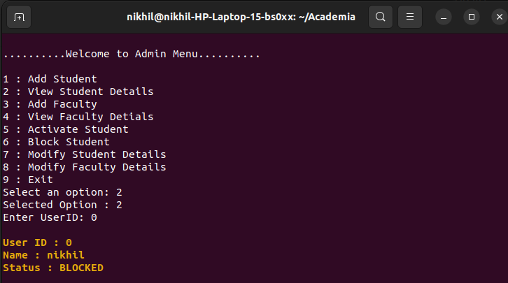
- Modify Faculty Details:
# 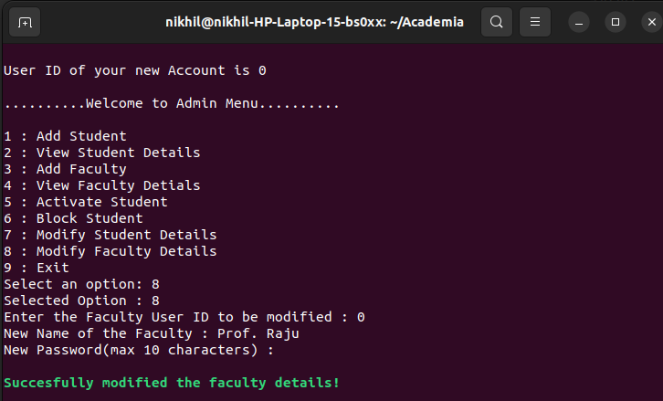

<br>

<b>Faculty Functions -<b>
- Add a new course:
# 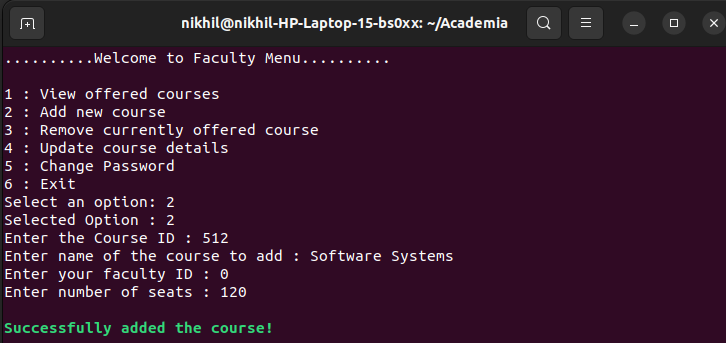
- View offered courses:
# 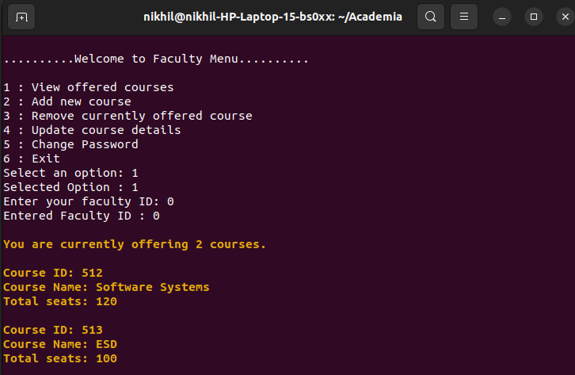
- Modify course details:
# 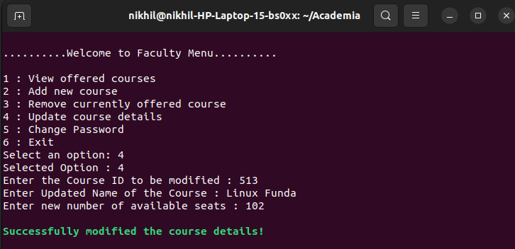
- After modifying course:
# 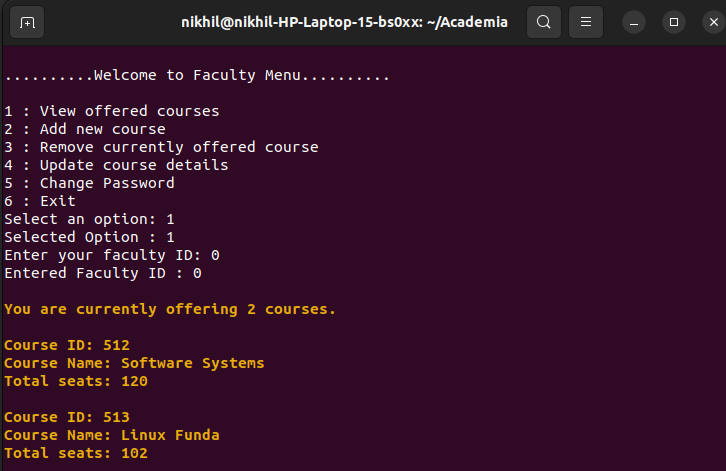

<br>

<b>Student Functions -</b>
- View all courses:
# 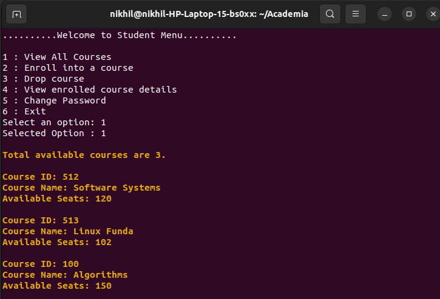
- Enroll in a course:
# 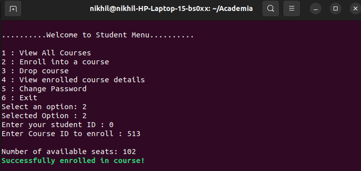
- View Enrolled Courses:
# 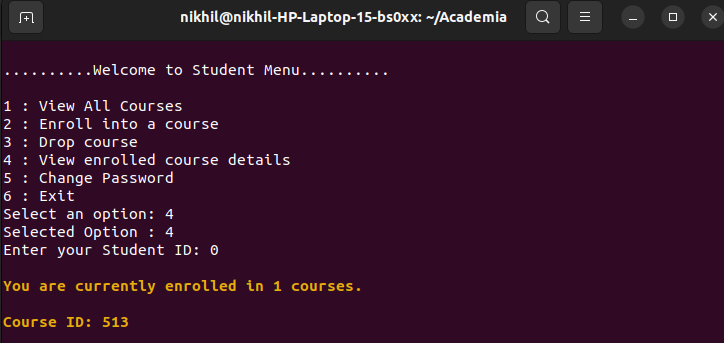
- Unenroll from a course:
# 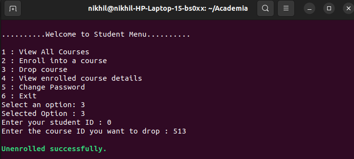


